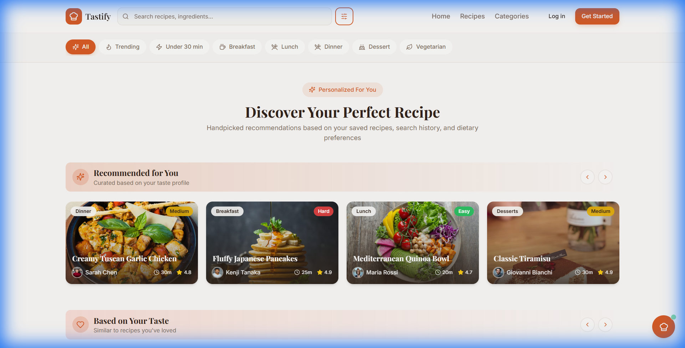
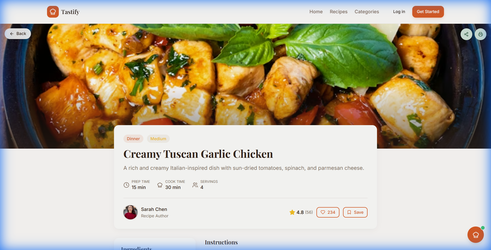
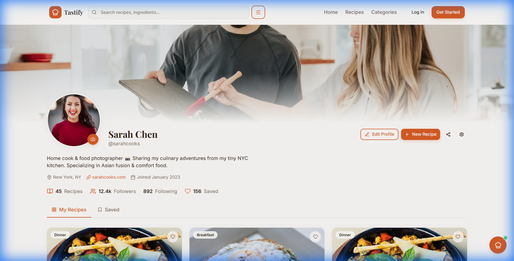
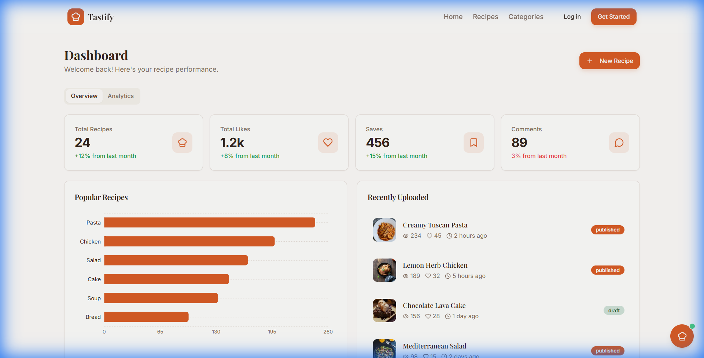

<h1 align="center">Recipshare 🍽️</h1>

<h3 align="center">
  🍽️ Cooking ideas come alive with code & creativity
</h3>

<p align="center">
  <strong>Discover, Share, and Savor Delicious Recipes from Around the World</strong>
</p>

<p align="center">
  
  
  
  
  
</p>

<p align="center">
  
</p>

---

## 📖 About The Project

**Recipshare** is a modern, full-stack web application designed to bring food enthusiasts together. Whether you're a home cook looking for dinner inspiration, a food blogger wanting to share your culinary creations, or a student learning to cook, this platform offers everything you need.

### 🎯 Core Goals

- **Share Recipes** — Publish your favorite recipes with detailed instructions, ingredients, and beautiful photos
- **Discover New Dishes** — Explore a diverse collection of recipes from various cuisines and categories
- **User Interaction** — Connect with fellow food lovers through likes, comments, and ratings
- **AI-Powered Assistant** — Get intelligent recipe suggestions, ingredient substitutions, and cooking tips

### 👥 Target Audience

| Audience | Benefits |
|----------|----------|
| 🏠 **Home Cooks** | Find inspiration for daily meals and special occasions |
| 📝 **Food Bloggers** | Showcase recipes and build a following |
| 🎓 **Students** | Learn cooking basics with easy-to-follow recipes |
| 👨‍🍳 **Professional Chefs** | Share expertise and discover trending cuisines |

---

## 🎬 Animated Demos

### Home Feed
<p align="center">
  
</p>
<p align="center"><em>Browse trending recipes with smooth animations and intuitive filtering</em></p>

### Recipe Submission
<p align="center">
  
</p>
<p align="center"><em>Create and publish recipes with our step-by-step form wizard</em></p>

### AI Recipe Assistant
<p align="center">
  
</p>
<p align="center"><em>Chat with our AI assistant for personalized cooking advice</em></p>

### Dashboard Analytics
<p align="center">
  
</p>
<p align="center"><em>Track your recipe performance with interactive analytics</em></p>

---

## ✨ Features

### 🔐 Core Features
- **User Authentication** — Secure sign-up, login, and profile management
- **Recipe Management** — Create, edit, and delete your recipes
- **Advanced Search** — Filter recipes by category, cuisine, difficulty, and cooking time
- **Responsive Design** — Seamless experience across desktop, tablet, and mobile

### 💫 Advanced Features
- **Likes & Favorites** — Save recipes you love for quick access
- **Comments & Ratings** — Share feedback and rate recipes
- **Social Profiles** — Follow other users and build your foodie network
- **Recipe Collections** — Organize recipes into custom collections

### 🤖 AI Assistant Features
- **Recipe Suggestions** — Get personalized recommendations based on preferences
- **Ingredient Substitutions** — Find alternatives for missing or dietary-restricted ingredients
- **Cooking Tips** — Receive expert advice for perfecting your dishes
- **Meal Planning** — AI-powered weekly meal suggestions

### 📊 Dashboard & Admin
- **Analytics Dashboard** — Track views, likes, and engagement metrics
- **Content Moderation** — Admin tools for managing user content
- **User Management** — Role-based access control
- **Activity Reports** — Detailed insights into platform usage

---

## 📸 Screenshots

<table>
  <tr>
    <td align="center" width="50%">
      
      <br/>
      <strong>Home Page</strong>
      <br/>
      <em>Discover trending and featured recipes</em>
    </td>
    <td align="center" width="50%">
      
      <br/>
      <strong>Recipe Details</strong>
      <br/>
      <em>View ingredients, steps, and nutrition info</em>
    </td>
  </tr>
  <tr>
    <td align="center" width="50%">
      
      <br/>
      <strong>User Profile</strong>
      <br/>
      <em>Manage your recipes and favorites</em>
    </td>
    <td align="center" width="50%">
      
      <br/>
      <strong>Analytics Dashboard</strong>
      <br/>
      <em>Track performance and engagement</em>
    </td>
  </tr>
</table>

---

## 🛠️ Tech Stack

| Category | Technologies |
|----------|-------------|
| **Frontend** | React 18, TypeScript, Tailwind CSS, Vite, shadcn/ui |
| **State Management** | TanStack Query (React Query) |
| **Routing** | React Router v6 |
| **Forms** | React Hook Form, Zod Validation |
| **UI Components** | Radix UI, Lucide Icons |
| **Backend** | Node.js, Express.js |
| **Database** | PostgreSQL / MongoDB |
| **Authentication** | Firebase Auth / JWT |
| **AI Integration** | OpenAI API / Google Gemini |
| **Cloud Storage** | AWS S3 / Cloudinary |
| **DevOps** | Docker, GitHub Actions, Vercel |

---

## 🏗️ System Architecture

<p align="center">
  
</p>

### Data Flow

1. **Client Layer** — React frontend handles user interactions and renders UI
2. **API Gateway** — Validates requests and routes to appropriate services
3. **Application Server** — Processes business logic and handles CRUD operations
4. **Database Layer** — Stores user data, recipes, and relationships
5. **Cloud Storage** — Manages recipe images and media files
6. **AI Service** — Processes natural language queries and generates recommendations

```
┌─────────────┐     ┌─────────────┐     ┌─────────────┐
│   Client    │────▶│   API       │────▶│   Backend   │
│   (React)   │◀────│   Gateway   │◀────│   Server    │
└─────────────┘     └─────────────┘     └──────┬──────┘
                                               │
                    ┌──────────────────────────┼──────────────────────────┐
                    │                          │                          │
                    ▼                          ▼                          ▼
             ┌─────────────┐           ┌─────────────┐           ┌─────────────┐
             │  Database   │           │   Cloud     │           │     AI      │
             │ (PostgreSQL)│           │   Storage   │           │   Service   │
             └─────────────┘           └─────────────┘           └─────────────┘
```

---

## 📁 Project Structure

```
recipe-sharing-website/
├── public/
│   ├── favicon.ico
│   └── assets/
├── src/
│   ├── components/
│   │   ├── ui/                 # Reusable UI components
│   │   ├── layout/             # Layout components
│   │   ├── recipe/             # Recipe-related components
│   │   └── auth/               # Authentication components
│   ├── pages/
│   │   ├── Home.tsx
│   │   ├── RecipeDetails.tsx
│   │   ├── Profile.tsx
│   │   ├── Dashboard.tsx
│   │   └── Auth.tsx
│   ├── hooks/                  # Custom React hooks
│   ├── lib/                    # Utility functions
│   ├── types/                  # TypeScript type definitions
│   ├── data/                   # Mock data and constants
│   ├── App.tsx
│   ├── App.css
│   ├── main.tsx
│   └── index.css
├── assets/
│   ├── gifs/
│   ├── screenshots/
│   ├── diagrams/
│   └── images/
├── .env.example
├── .gitignore
├── package.json
├── tailwind.config.ts
├── tsconfig.json
├── vite.config.ts
└── README.md
```

---

## 🚀 Installation & Setup

### Prerequisites

- Node.js 18+ and npm
- Git

### Step 1: Clone the Repository

```bash
git clone https://github.com/yourusername/recipe-sharing-website.git
cd recipe-sharing-website
```

### Step 2: Install Dependencies

```bash
# Install frontend dependencies
npm install
```

### Step 3: Configure Environment Variables

Create a `.env` file in the root directory:

```bash
cp .env.example .env
```

Update the environment variables with your credentials (see section below).

### Step 4: Start Development Server

```bash
npm run dev
```

The application will be available at `http://localhost:8080`

### Step 5: Build for Production

```bash
npm run build
npm run preview
```

---

## 🔧 Environment Variables

Create a `.env` file with the following variables:

```env
# Application
VITE_APP_NAME=Recipshare
VITE_APP_URL=http://localhost:8080

# Firebase Authentication
VITE_FIREBASE_API_KEY=your_firebase_api_key
VITE_FIREBASE_AUTH_DOMAIN=your_project.firebaseapp.com
VITE_FIREBASE_PROJECT_ID=your_project_id
VITE_FIREBASE_STORAGE_BUCKET=your_project.appspot.com
VITE_FIREBASE_MESSAGING_SENDER_ID=your_sender_id
VITE_FIREBASE_APP_ID=your_app_id

# Backend API
VITE_API_BASE_URL=http://localhost:3000/api

# AI Integration
VITE_OPENAI_API_KEY=your_openai_api_key

# Cloud Storage
VITE_CLOUDINARY_CLOUD_NAME=your_cloud_name
VITE_CLOUDINARY_UPLOAD_PRESET=your_upload_preset
```

---

## 🔮 Future Enhancements

| Feature | Description | Status |
|---------|-------------|--------|
| 📱 **Mobile App** | Native iOS and Android applications | 🔄 Planned |
| 📅 **Meal Planner** | Weekly meal planning with calendar integration | 🔄 Planned |
| 🛒 **Grocery List** | Auto-generate shopping lists from selected recipes | 🔄 Planned |
| 🎤 **Voice AI** | Voice-based recipe assistant for hands-free cooking | 💡 Ideation |
| 🔗 **Social Sharing** | Share recipes directly to social media platforms | 💡 Ideation |
| 🌐 **Multi-language** | Support for multiple languages | 💡 Ideation |
| 📊 **Nutrition API** | Automatic nutritional information calculation | 🔄 Planned |

---

## 🤝 Contributing

Contributions are what make the open-source community amazing! Any contributions you make are **greatly appreciated**.

### How to Contribute

1. **Fork the Project**
   ```bash
   git fork https://github.com/yourusername/recipe-sharing-website.git
   ```

2. **Create a Feature Branch**
   ```bash
   git checkout -b feature/AmazingFeature
   ```

3. **Commit Your Changes**
   ```bash
   git commit -m "Add: AmazingFeature"
   ```

4. **Push to the Branch**
   ```bash
   git push origin feature/AmazingFeature
   ```

5. **Open a Pull Request**

### Contribution Guidelines

- Follow the existing code style and conventions
- Write clear, descriptive commit messages
- Update documentation for any new features
- Add tests for new functionality when applicable
- Ensure all tests pass before submitting PR

---

## 📄 License

This project is licensed under the **MIT License** — see the [LICENSE](LICENSE) file for details.

```
MIT License

Copyright (c) 2024 Recipshare

Permission is hereby granted, free of charge, to any person obtaining a copy
of this software and associated documentation files (the "Software"), to deal
in the Software without restriction, including without limitation the rights
to use, copy, modify, merge, publish, distribute, sublicense, and/or sell
copies of the Software, and to permit persons to whom the Software is
furnished to do so, subject to the following conditions:

The above copyright notice and this permission notice shall be included in all
copies or substantial portions of the Software.
```

---

<p align="center">
  <strong>Built with ❤️ by Om Shinde</strong>
</p>

<p align="center">
  <a href="https://github.com/yourusername">
    
  </a>
</p>

<p align="center">
  If you found this project helpful, please consider giving it a ⭐️
</p>

<p align="center">
  <a href="#recipe-sharing-website-️">Back to Top ↑</a>
</p>
